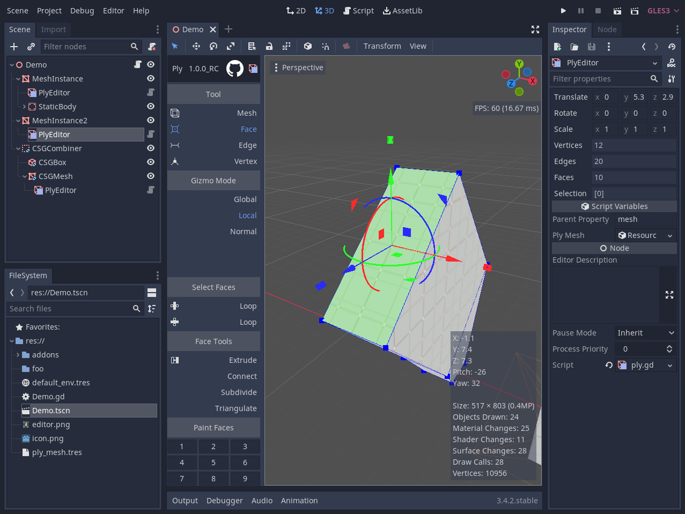

#  godot-ply 
Godot plugin for in-editor box modelling for gray boxing or prototyping 3d levels.



The `main` branch is active development for Godot 4. See releases for stable releases.

See demos [on youtube](https://www.youtube.com/channel/UCf1IV6ABf3a4nW1wEyPwmMQ).

## Installation
- Copy the contents of the plugin directory in this repository into your `addons` folder for your Godot project.
- Activate the plugin in your project settings.

## Usage
Create a  PlyEditor node as the child of a MeshInstance or CSGMesh and select it.

### Editing Meshes
There are four selection modes:
-  ` 1 ` Mesh
-  ` 2 ` Face
-  ` 3 ` Edge
-  ` 4 ` Vertex

Shift + Clicking will add and subtract from the set of selections.
<br>Alt + Clicking in edge or face mode will select loops.

And three gizmo modes:
- Global - Translate/Rotate/Scale along global coordinates
- Local - Translate/Rotate/Scale along local model coordinates
- Normal - Translate/Rotate/Scale along coordinates aligned to the average normal of the selected geometry

The gizmo behaves much like the standard Godot gizmo; however, it includes scale handles by default.
- Translate Axis: Arrows
- Translate Plane: Squares
- Rotate Around Axis: Arcs
- Scale Axis: Cubes
- Scale Plane: Triangles

The inspector includes translate/rotate/scale tools for fine-tuning, respecting the selected gizmo mode.

There are tools for each selection mode:
- Mesh
	- Mesh Tools
		- Subdivide: Subdivide all quads/tris into four quads/tris
		- Triangulate: Triangulate all faces using an ear clipping algorithm
		- Invert Normals: Inverts the normals of all faces
	- Mesh Utilities
		- Export to OBJ: Exports the selected mesh to an OBJ file
			- Currently exports basic geometry, excluding normals, materials, etc
		- Quick Generators
			- Plane: Generate a two-sided unit plane
			- Cube: Generate a unit cube
		- Generate: Opens a modal for more advanced generation
			- Plane: Generate a plane with a specified size and subdivision count
			- Cube: Generate a cube with a specified size and subdivision count
			- Isosphere: Generate an isosphere with a specified radius and subdivisions
			- Cylinder: Generate a cylinder with a specified radius, depth, and circle vertex count

- Face
	- Select Faces
		-  Loop: a quad loop in one direction
		-  Loop: a quad loop in the other direction
	- Face Tools
		-  ` ctrl-e ` Extrude: Extrudes the selected face(s) along their mean normal by 1 unit
		- Connect: Remove the two selected faces, creating a new face between edges. Tries to choose an edge pairing that works.. but not always.
		- Subdivide: Subdivide a quad or a tri into 4 quads or 4 tris
		- Triangulate: Triangulates a face using an ear clipping algorithm
	- Paint Faces: Moves the selected face to the chosen surface, allowing multiple materials per mesh. Assign materials to the parent MeshInstance or in the Ply Editor materials array.
- Edge
	- Select Edges
		-  Loop: Select an edge loop from the given edge
	- Edge Tools
		-  ` ctrl-r ` Cut Loop: Add a loop cut perpindicular to the selected edge
		-  Subdivide: Splits the selected edge into two parallel edges
		-  Collapse: Collapses an edge into a single vertex at its midpoint
- Vertex
	- None, yet!

### Collisions
Collision meshes are updated if there is a CollisionShape child of the parent MeshInstance node at `$StaticBody/CollsionShape`. This is the default naming if you use the `Create Trimesh Static Body` tool.

## Details
Meshes are meant to only be oriented manifolds. Some properties:
- Each edge has one or two faces (although we generally use precisely 2)
- All of an edge's faces have compatible orientation -- that is, the edge origin and destination are in the opposite order for opposite faces.

Ply uses a winged edge representation for edges but omits counterclockwise navigation:
```
omitted
left ccw        right cw
		 \     /
		  \   /
		   \ /
			o destination
			^
			|
left face   |   right face
			|
			o origin
		   / \
		  /   \
		 /     \
left cw          right ccw
				 omitted
```

### Implications
Given this representation, a few limitations occur that are representable in other tools:
- One cannot arbitrarily extrude edges into one-sided faces, or one edge would be incident with >2 faces.
- One cannot flip individual faces, as the faces would no longer have compatible orientation.

## Contributing

Feel free to contribute! Both issues and pull requests are very welcome.

Feel free to contact me on the [godot discord server](https://discord.gg/4JBkykG), where my name is `hints`
